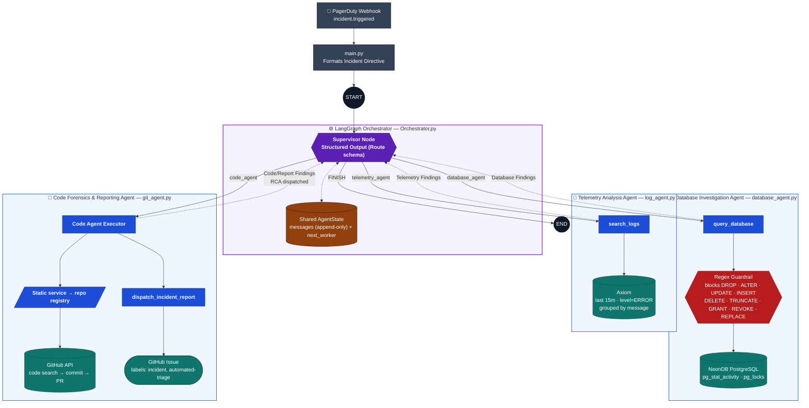

# Multi-Agent Incident Analyzer & Triage

An autonomous, AI-driven Site Reliability Engineering (SRE) orchestrator that triages, investigates, and documents distributed microservice incidents — from the first alert down to the exact commit that caused the regression.

Built with **Python**, **LangGraph**, and **Google Gemini 3.7 Flash**, the system coordinates a Supervisor node with three specialized domain-expert agents to trace a failure from application telemetry → database locks → source code, and closes the loop by filing a Root Cause Analysis (RCA) directly as a GitHub Issue.

---

## Project Overview

Incident response usually means an engineer manually correlating dashboards, log queries, database locks, and recent deploys under pressure. This project automates that correlation chain end-to-end using a multi-agent system built on LangGraph's `StateGraph`:

- A **Supervisor** evaluates the shared investigation state and decides which specialist to call next.
- Three **domain-expert agents** — Telemetry, Database, and Code — each own one integration surface and one job.
- The Supervisor loops the investigation between agents until enough evidence exists to synthesize and publish a final RCA, then halts.

---

## What It Does

1. Ingests an incident alert (currently simulated as a structured **PagerDuty webhook v3 payload** in `main.py`, originally sourced from a Datadog monitor).
2. Formats the alert into a directive and hands it to the **Orchestrator**.
3. The **Supervisor** routes the investigation to the Telemetry Agent to isolate the failing service and error signature from application logs.
4. Once a service/error is identified, the Supervisor routes to the **Database Agent** to inspect PostgreSQL for locks, blocked transactions, or connection exhaustion.
5. With a locked table identified, the Supervisor routes to the **Code Agent**, which maps that table to its corresponding Java domain entity, finds the offending commit/PR in GitHub, and **dispatches a full RCA as a GitHub Issue**.
6. The Supervisor confirms the report was dispatched and terminates the graph (`FINISH` → `END`).

---

## How It Works (Architecture)

**Shared State (`AgentState`)**
```python
class AgentState(TypedDict):
    messages: Annotated[Sequence[BaseMessage], operator.add]  # accumulates evidence
    next_worker: str                                          # supervisor's routing decision
```
Every agent's findings are appended (never overwritten) to `messages`, so the Supervisor always reasons over the *full* evidence trail before making its next routing call.

**Routing**
The Supervisor doesn't emit free-form text — it's bound to a Pydantic schema (`Route`) via `llm.with_structured_output()`, constraining its output to exactly one of: `telemetry_agent`, `database_agent`, `code_agent`, or `FINISH`.


Workers never talk to each other directly — every hand-off is mediated by the Supervisor re-evaluating the shared state.

**The Three Domain Experts**

| Agent | File | Tool(s) | Job |
|---|---|---|---|
| Telemetry Analysis | `log_agent.py` | `search_logs` | Query Axiom for recent error patterns on a service, grouped and counted by message |
| Database Investigation | `database_agent.py` | `query_database` | Run read-only diagnostic SQL against NeonDB (`pg_stat_activity`, `pg_locks`) to find blocking PIDs / locked tables |
| Code Forensics & Reporting | `git_agent.py` | `search_git_commits`, `dispatch_incident_report` | Map a locked table to a Java domain entity, find the commit/PR that touched it, and file the RCA to GitHub Issues |

---

## Key Features

- **Structured, deterministic routing** — Supervisor decisions are constrained to a Pydantic `Literal` schema; there's no free-text routing to parse or misinterpret.
- **Zero-temperature reasoning everywhere** — every agent (`temperature=0`) and every system prompt explicitly enforces "0% hallucination" grounding on tool output only.
- **Read-only SQL guardrail** — `query_database` regex-rejects any query containing `DROP`, `ALTER`, `UPDATE`, `INSERT`, `DELETE`, `TRUNCATE`, `GRANT`, `REVOKE`, or `REPLACE` before it ever reaches the database.
- **Static service→repository registry** — `git_agent.py`'s system prompt hard-maps known service names (`order-service`, `payment-service`, `inventory-service`) to their GitHub repo strings for targeted forensics.
- **Rate-limit-aware GitHub calls** — `search_git_commits` inserts a 2-second cooling period before each of its three sequential GitHub API calls (code search → commit lookup → associated PR lookup).
- **Circuit breakers** — the full orchestrated run uses `recursion_limit=20`; each individual agent additionally exposes its own standalone `run_triage()` harness with `recursion_limit=15` for isolated testing.
- **Labeled, automated GitHub Issue dispatch** — final RCA is filed with `["incident", "automated-triage"]` labels via `dispatch_incident_report`.

---

## Strengths

- **Clean separation of concerns** — each agent owns exactly one integration surface (Axiom / Postgres / GitHub), which keeps prompts, tools, and failure modes isolated and easy to reason about.
- **Evidence-driven routing, not rigid sequencing** — the Supervisor prompt explicitly instructs it to route based on *what's missing from the state*, not a fixed agent order, and to reroute on partial/failed results rather than halting.
- **Fully autonomous, closed-loop escalation** — no human is required between alert ingestion and the final GitHub Issue; the graph only terminates once dispatch is confirmed.
- **Composable and independently testable** — every agent file (`log_agent.py`, `database_agent.py`, `git_agent.py`) is runnable on its own via its own `run_triage()`, separate from the full `Orchestrator.py` graph.
- **Defense in depth on the database tool** — even though prompts instruct read-only behavior, the regex validation in `tools.py` enforces it at the application level regardless of what the LLM generates.

---

## Challenges It Handles

- **Cross-agent data dependencies (context starvation)** — the Supervisor prompt's "Dependency Management" rule ensures `database_agent` / `code_agent` are only invoked once upstream agents have produced a concrete identifier (e.g., a specific service name or locked table), rather than guessing.
- **GitHub API rate limiting during multi-step forensics** — the three sequential GitHub calls in `search_git_commits` (code search → commit → PR) are each preceded by a short cooling period.
- **Autonomous escalation without human intervention** — the Supervisor's completion criterion is strictly "RCA dispatched and confirmed," synthesizing telemetry, SQL evidence, and commit/PR data into one actionable GitHub Issue before halting.

---

## Tech Stack

| Layer | Technology |
|---|---|
| Orchestration | LangGraph (`StateGraph`) |
| Agent framework | LangChain (`langchain.agents.create_agent`) |
| LLM | Google Gemini 3.7 Flash (`langchain_google_genai`, `temperature=0`) |
| Structured output | Pydantic |
| Observability | Axiom (REST / APL) |
| Database | PostgreSQL via NeonDB (`psycopg2`) |
| Source control / issue tracking | GitHub REST API |
| Incident source | PagerDuty webhook (v3 payload format) |
| Config | `python-dotenv` |

---

## Project Structure

```
.
├── main.py             # Entry point — builds a sample PagerDuty payload, triggers the orchestrated run
├── Orchestrator.py      # AgentState, Route schema, supervisor node, worker nodes, compiled StateGraph (MAF)
├── log_agent.py         # Telemetry Analysis Agent (search_logs)
├── database_agent.py    # Database Investigation Agent (query_database)
├── git_agent.py         # Code Forensics & Reporting Agent (search_git_commits, dispatch_incident_report)
└── tools.py              # All external integrations: Axiom, NeonDB, GitHub search, GitHub Issues
```

---

## Environment Variables

Create a `.env` file in the project root with the following keys:

```env
GOOGLE_API_KEY=your_google_api_key
AXIOM_API_TOKEN=your_axiom_api_token
AXIOM_DATASET=your_axiom_dataset_name
NEONDB_URL=your_neondb_postgres_connection_string
GITHUB_TOKEN=your_github_personal_access_token
GITHUB_REPO=your_org/your_reporting_repo
```

Notes:
- `GITHUB_TOKEN` is used both for searching commits in a service's own repo (`search_git_commits`) and for filing the final RCA (`dispatch_incident_report`) — it needs read access to the target service repos and issue-write access to `GITHUB_REPO`.
- `GITHUB_REPO` is the repository where the **RCA issue is filed**. This is separate from the per-service `target_repo` values, which are hard-coded inside `git_agent.py`'s system prompt (currently `order-service`, `payment-service`, `inventory-service`).

---

## Running It Locally

1. **Install dependencies:**
   ```bash
   pip install langchain langchain-google-genai langgraph langchain-core pydantic python-dotenv requests psycopg2-binary
   ```

2. **Set up your `.env` file** as described above.

3. **Run the orchestrated flow:**
   ```bash
   python main.py
   ```
   This currently seeds the graph with a **hardcoded sample incident** (a P99 latency spike on `order-service`) defined in `main.py` — it does not yet listen for live PagerDuty webhooks over HTTP. To wire it into real alerts, you'd add a webhook receiver (e.g. a Flask/FastAPI route) that parses the incoming payload the same way `main.py` does and calls `Orchestrator.run_triage()`.

4. **Expected console output shape:**
   ```
   --- INITIATING MULTI-AGENT INCIDENT TRIAGE ---
   Alert Received: <formatted incident directive>

   [Node Activated] -> supervisor
   [Routing Decision] -> Delegating to telemetry_agent

   [Node Activated] -> telemetry_agent
   [Worker Output] -> Telemetry Findings: <...>

   ... (loops through database_agent / code_agent as needed) ...

   === INVESTIGATION COMPLETE ===
   ```
   If the recursion limit is hit or a tool call fails unrecoverably, you'll instead see `[SYSTEM HALTED] Error during execution: <error>`.

5. **Testing a single agent in isolation:** each of `log_agent.py`, `database_agent.py`, and `git_agent.py` defines its own `run_triage(incident_message)` (with `recursion_limit=15`) for testing that agent alone, outside the full orchestrated graph. These aren't wired to a CLI entry point, so invoke them directly, e.g.:
   ```python
   from log_agent import run_triage
   run_triage("Investigate latency spike on order-service")
   ```
